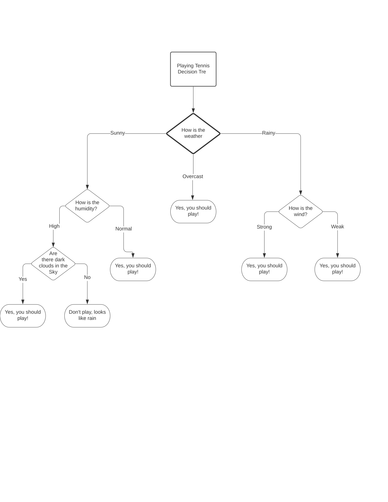

# HTML Decision Tree

This is a generic library for building a simple web-based decision trees UI.
Data is provided in JSON format, which is then displayed on a website.
The tree is fully accessible both in terms of keyboard browsing and screen reading. 
It has been tested with all major screenreaders.


## Installing and Building

The code is in Typescript. After cloning the repository, just type

``` Bash
npm install
npm run-script build
```

This builds the `decisiontree.js` library in `dist`.

Alternative build is done using typescript and webpack:

``` Bash
npx tsc
npx webpack
```

Or simply install the package using 

``` Bash
npm install html-decision-tree
```

## Simple Example

Here is a very simple decision tree for deciding if you should play tennis:

[Tennis example](https://zorkow.github.io/html-decision-tree/samples/tennis.html)

Here is the corresponding flow chart decision tree for deciding if you should play tennis in SVG




and in [JSON format](./samples/tennis.json).


## JSON Format

Current node format in some pseudo grammar:

```Javascript
{
type: binary|nary|null,
value: 0-9+,
title: \w*,
content: \w*,
labels: [{
  text: \w*,
  value: 0-9+,
  }],
children: [node*],
action: URL
}
```

The idea is nary nodes have content (that is the description on the radio
button) which is linked via the value to the children . Binary nodes have
default description content as Yes (0) and No (1). Actions are only considered
in leaf nodes and open a new Tab.

### Acknowledgments

* **Carlos Cavalie**, [ETS](https://www.ets.org), for accessibility testing and
  design
* **Brian Hochhalter** for UI design and wireframe design and prototyping
* **Danielle Vargas**, [W.W.Norton](https://wwnorton.com/), for CSS styles,
  accessibility testing and design
* **Amaya Webster**, [benetech](https://benetech.org), for suggesting the
  initial idea at the 2020 DIAGRAM and ETS Code Sprint

